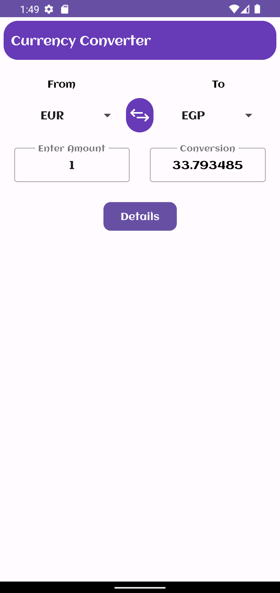
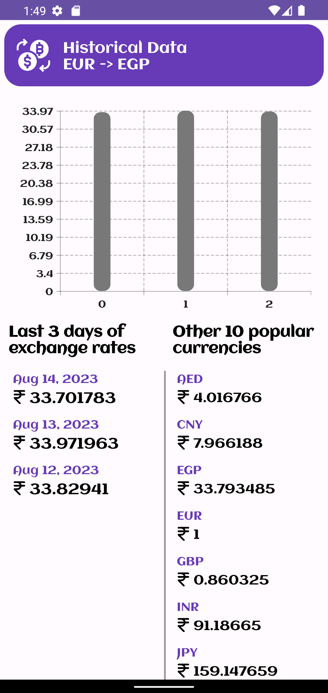

# Currency converter
Currency app is designed to help customers to hand different currency conversions.

## Features
## Convert Currency
- From/To dropdown lists showing all available currencies.
- Input field for amount (numbers only), by default always 1, and another input
- field to show the converted value.
- On amount change, converted value changed, And vice versa.
- Button to swap the values in FROM and TO, and accordingly converted data
changed.

## Historical Data
When details is pressed, we can see new screen having historical data for last 3
days (day by day) in the following look:
- Historical data for last 3 days viewed in a list
- Historical data for last 3 days viewed on chart

## Other Currencies
When details is pressed, we can see new screen having conversion from the same
base currency to 10 different popular currencies

## Tech
- [Navigation component](https://developer.android.com/guide/navigation?gclid=Cj0KCQjwmouZBhDSARIsALYcouoEzVh473bVV4ZKen9DrESxlnro7zH0Ue17y8ItumGVs558UFtPZLMaArvcEALw_wcB&gclsrc=aw.ds) - App navigation -> Single activity concept.
- [Safe Args](https://developer.android.com/guide/navigation/navigation-pass-data) - For type-safe passing objects between screens.
- [Dagger-Hilt](https://developer.android.com/training/dependency-injection/hilt-android) - For dependency injection.
- [Retrofit](https://square.github.io/retrofit/) - Network.
- [Gson](https://github.com/square/retrofit/tree/master/retrofit-converters/gson) - Serialization.
- [Kotlin coroutines](https://developer.android.com/kotlin/coroutines) - Concurrency.
- [Livedata](https://developer.android.com/topic/libraries/architecture/livedata)
- [Viewmodel](https://developer.android.com/topic/libraries/architecture/viewmodel?gclid=Cj0KCQjwmouZBhDSARIsALYcouowU4bI_Dxt9XRlsd4-qAblwn2Vk3jgw86XJFJdhJuraSbTxzGNgwMaAvejEALw_wcB&gclsrc=aw.ds)
- [View Binding](https://developer.android.com/topic/libraries/view-binding)

## Screenshots
<kbd></kbd>
<kbd></kbd>